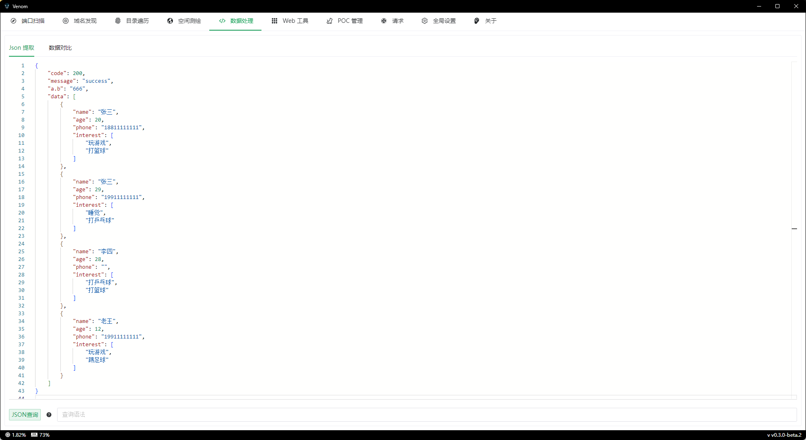

功能介绍，更加方便的使大家将json数据中的数据提取出来，不用再去写脚本


演示数据

```json
{
    "code": 200,
    "message": "success",
    "a.b": "666",
    "data": [
        {
            "name": "张三",
            "age": 20,
            "phone": "18811111111",
            "interest": [
                "玩游戏",
                "打篮球"
            ]
        },
        {
            "name": "张三",
            "age": 29,
            "phone": "19911111111",
            "interest": [
                "睡觉",
                "打乒乓球"
            ]
        },
        {
            "name": "李四",
            "age": 28,
            "phone": "",
            "interest": [
                "打乒乓球",
                "打篮球"
            ]
        },
        {
            "name": "老王",
            "age": 12,
            "phone": "19911111111",
            "interest": [
                "玩游戏",
                "踢足球"
            ]
        }
    ]
}
```


### 基础用法

```
code			200
message			"success"
data.0.name		"张三"
data.1.age		28
```


### 通配符

key 支持 `*` 和 `?` 两种通配符

- **`*`：**匹配 >= 0 个字符
- **`?`：**匹配 1 个字符

```
me*			"success"
me?sage		"success"
```


### 转义

有一些符号（`.` `?` `*`）已经存在特殊用途，但如果数据中存在了这些字符，就需要进行转义

```
a\.b	"666"
```


### 循环

```
data.#			4
data.#.name		["张三","张三","李四","老王"]
```


### 查询

语法`#(...)` 、`#(...)#`

只能用在数组中，因为不是数组没必要搜索，直接指定 key 就拿到结果了

支持的关系运算符

- `==`：查找等于某个值的数据
- `!=`：查找不等于某个值的数据
- `<`：查找小于某个值的数据
- `<=`：查找小于等于某个值的数据
- `>`：查找大于某个值的数据
- `>=`：查找大于等于某个值的数据

以及

- `%`：类似于 mysql 的 like。
- `!%`：类似于 mysql 的 not like。

使用 like 就可以使用通配符

```
data.#(name=="张三").name			"张三"
data.#(name=="张三")#.name		["张三","张三"]
data.#(age<25)#.name			["张三","老王"]
data.#(name%"张*")#.name			["张三","老王"]
data.#(name!%"张*")#.name		["李四","老王"]
```


### 嵌套查询

```json
data.#(interest.#(=="玩游戏"))#.name	["张三","老王"]
```


### 波浪号

`~` 操作符用于在查询中转换和比较布尔值，并判断值是否存在。

```
~true      将“类似真”（true-ish）的值转换为 true
~false     将“类似假”（false-ish）和不存在的值转换为 true
~null      将 null 和不存在的值转换为 true
~*         将任何存在的值转换为 true
```


样例数据

```json
{
  "vals": [
    { "a": 1, "b": "data" },
    { "a": 2, "b": true },
    { "a": 3, "b": false },
    { "a": 4, "b": "0" },
    { "a": 5, "b": 0 },
    { "a": 6, "b": "1" },
    { "a": 7, "b": 1 },
    { "a": 8, "b": "true" },
    { "a": 9, "b": false },
    { "a": 10, "b": null },
    { "a": 11 }
  ]
}
```


要查询所有 true-ish 或 false-ish 值

```
vals.#(b==~true)#.a     [2,6,7,8]
vals.#(b==~false)#.a    [3,4,5,9,10,11]
```

不存在的最后一个值被视为`false`


要查询 null 值和显式值是否存在，请执行以下操作

```
vals.#(b==~null)#.a     [10,11]
vals.#(b==~*)#.a        [1,2,3,4,5,6,7,8,9,10]
vals.#(b!=~*)#.a        [11]
```


### 点与管道

`.` 是标准的分隔符，但也可以使用 `|`。在大多数情况下，它们返回的结果是相同的。不过在用于数组和查询的 `#` 之后时，`|` 的行为与 `.` 不同。

这些语法都能正常工作，因为它们是用来访问数组中对象的字段。

```
data.0.name						"张三"
data|0.name						"张三"
data.0|name						"张三"
data|0|name						"张三"
data.#							4
data|#							4
```


下面这些就要注意了

```
data.#(name=="张三")#.name		["张三","张三"]
data.#(name=="张三")#|name		错误
data.#(name=="张三")#.0			[]
data.#(name=="张三")#|0			{"name":"张三","age":20,"phone":"18811111111","interest":["玩游戏","打篮球"]}
data.#(name=="张三")#.#			[]
data.#(name=="张三")#|#			2
```


#### 解释一下

`data.#(name=="张三")#` 的结果是

```json
[
    {
        "name": "张三",
        "age": 20,
        "phone": "18811111111",
        "interest": [
            "玩游戏",
            "打篮球"
        ]
    },
    {
        "name": "张三",
        "age": 29,
        "phone": "19911111111",
        "interest": [
            "睡觉",
            "打乒乓球"
        ]
    }
]
```

在这个基础上，可以通过 `.` 和 `|` 来进一步操作

`data.#(name=="张三")#.name` 返回 `["张三","张三"]`。`#.name` 会在每个数组元素上获取 `name` 字段的值。

`data.#(name=="张三")#|name` 返回 `错误`，因为 `|name` 试图直接从数组结果中获取 `name` 字段，但数组并不包含这个字段。

`data.#(name=="张三")#.0` 返回 `[]`，因为在 `#` 之后使用 `.` 访问索引会导致空结果。

`data.#(name=="张三")#|0` 返回第一个匹配结果，即：

```json
{
    "name": "张三",
    "age": 20,
    "phone": "18811111111",
    "interest": [
        "玩游戏",
        "打篮球"
    ]
}
```

`|0` 能正确识别前一个结果是数组，并直接返回数组的第一个元素。

`data.#(name=="张三")#.#` 返回 `[]`，使用 `.` 后无法直接计算数组的长度。

`data.#(name=="张三")#|#` 返回 `2`，表示前一个查询结果（数组）的长度。


#### 总结

- 使用 `.` 在每个数组元素上逐级访问字段。
- 使用 `|` 直接操作整个数组结果。`|` 可直接访问数组的元素和长度。
- 在查询条件 `#(条件)#` 后，`|` 更灵活，可以直接获取数组长度或指定索引的元素。


### 修饰符

```
data.#.age.@reverse		[20,29,28,12]
```


现在已存在的修饰符

- `@reverse`：反转数组或对象的成员。
- `@ugly`：从 JSON 中删除所有空格。
- `@pretty`：使 JSON 更具人类可读性。
- `@this`：返回当前元素。它可用于检索根元素。
- `@valid`：确保 json 文档有效。
- `@flatten`：拼合数组。
- `@join`：将多个对象合并为一个对象。
- `@keys`：返回对象的键数组。
- `@values`：返回对象的值数组。
- `@tostr`：将 json 转换为字符串。包装 json 字符串。
- `@fromstr`：从 json 转换字符串。解包一个 json 字符串。
- `@group`：对对象数组进行分组。
- `@dig`：搜索值而不提供其整个路径。


### 多路径

以将多个路径组合在一起，以形成新的文档。使用 `[...]` 或 `{...}` 包裹逗号分隔的路径，分别会生成一个数组或对象。

```
data.#(name="张三")#.{name,phone,"first_interest":interest.0}
```

```json
[
    {
        "name": "张三",
        "phone": "18811111111",
        "first_interest": "玩游戏"
    },
    {
        "name": "张三",
        "phone": "19911111111",
        "first_interest": "睡觉"
    }
]
```

这里 `"first_interest"` 是一个自定义的键名，用于指定查询结果的键。如果没有指定键名，查询会自动使用原字段的名称，如果无法确定字段名称则用下划线 `_` 代替。


### 字面量

字面量以 `!` 声明字符开头

```
data.0.{name,phone,"from":!"chinese","is_happy":!true}
```

```json
{
    "name": "张三",
    "phone": "18811111111",
    "from": "chinese",
    "is_happy": true
}
```

`name` 和 `phone` 来自已有路径。

`from` 和 `is_happy` 是使用 JSON 字面量添加的静态字段。

