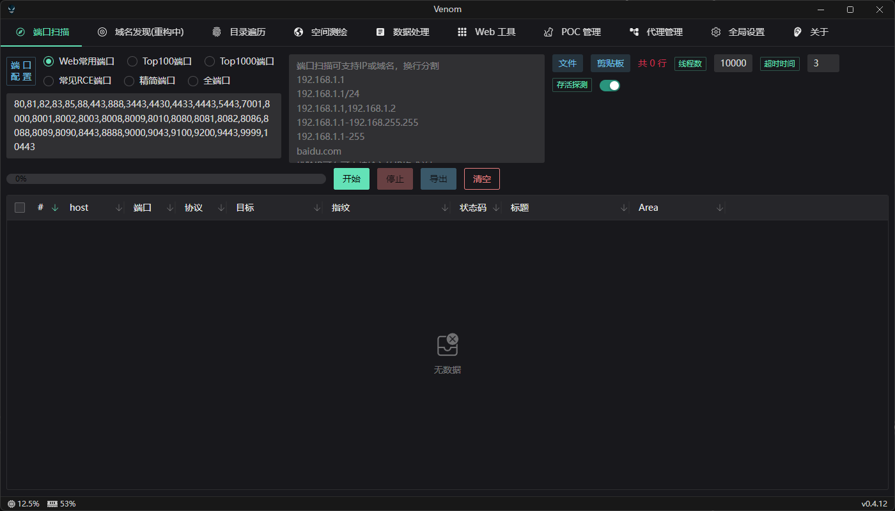
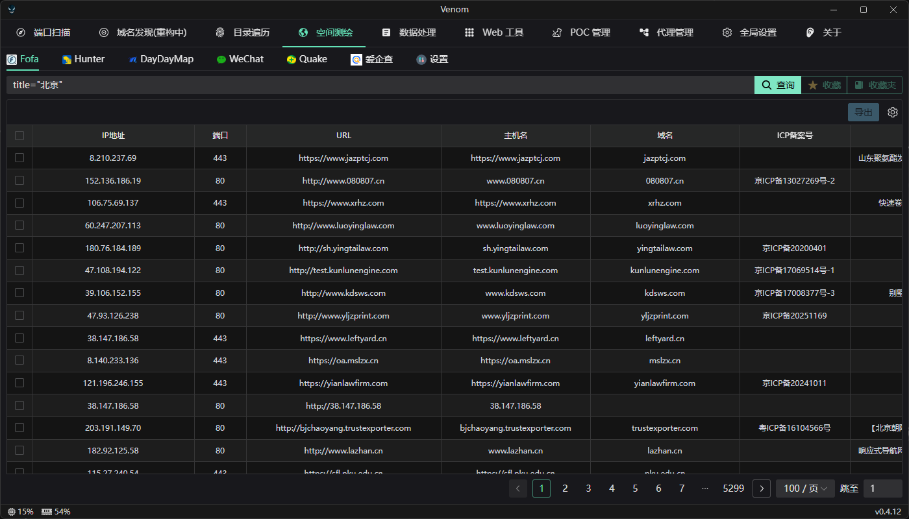
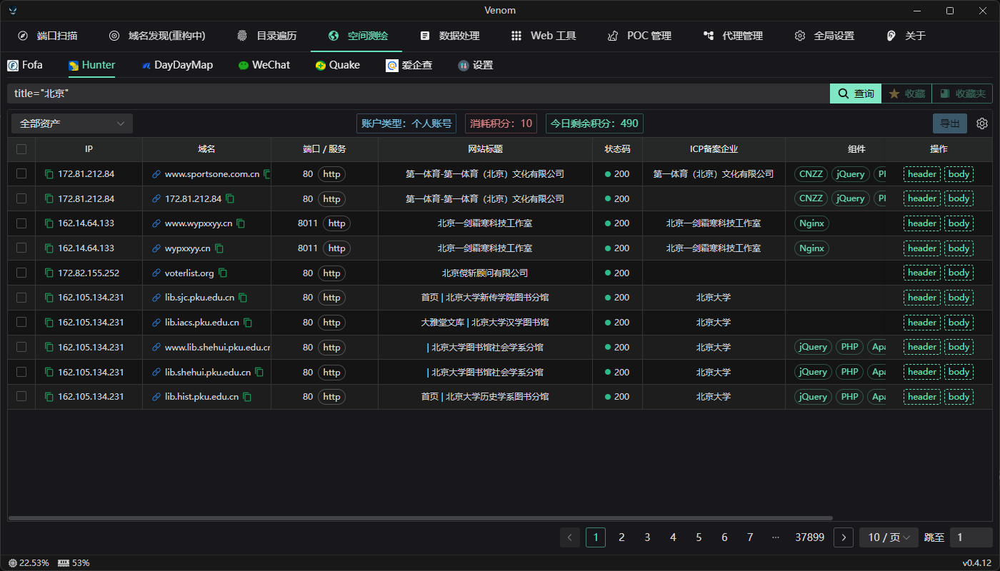
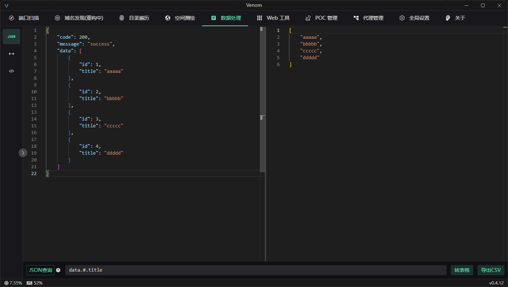
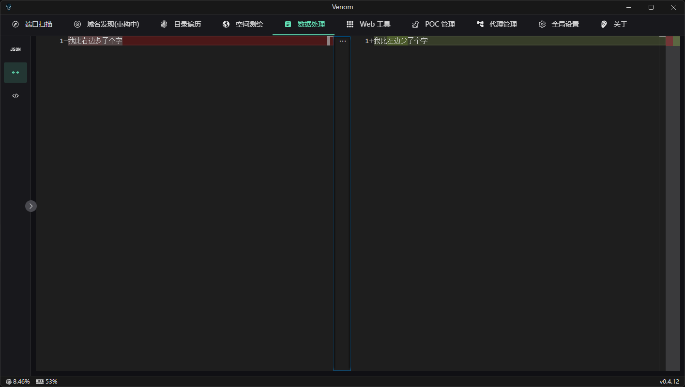
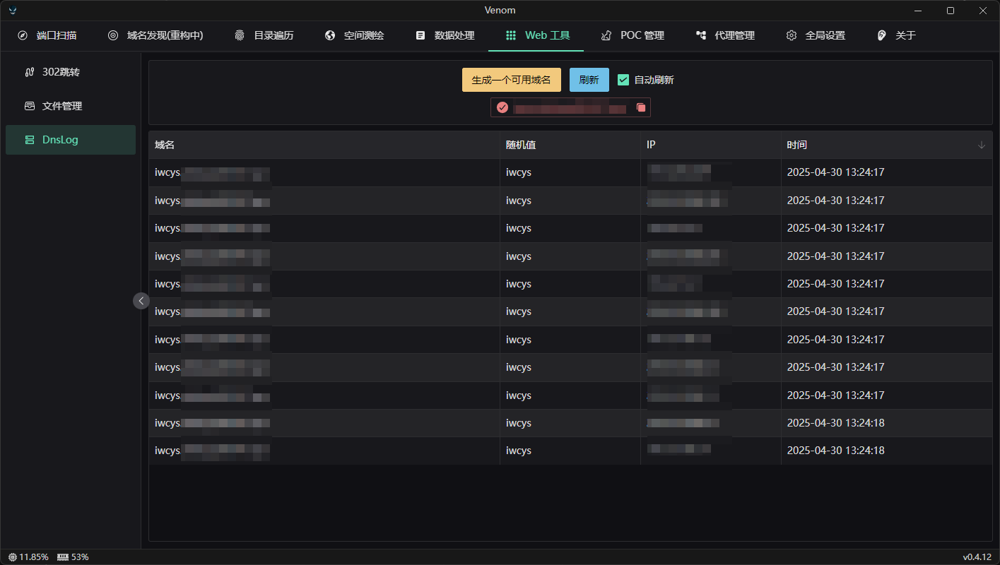

<h3 align="center">
  
</h3>

  

### 毒液 (Venom)

这是一款面向网络安全领域的综合性工具，旨在为渗透测试和安全研究提供高效、精准的支持。通过强大的核心能力与灵活的操作模式，全面覆盖目标系统的安全评估需求。无论是深度分析还是快速检测，该工具都能展现卓越的性能与可靠性，是提升安全工作效率的专业利器。

### 功能概览

- [ ] 端口扫描
  - [x] 存活探测
  - [x] 端口扫描
  - [ ] 指纹识别
- [ ] 域名发现
- [ ] 目录遍历
- [ ] 空间测绘
  - [x] Fofa
  - [x] Hunter
  - [ ] DayDayMap
  - [ ] Wechat
  - [ ] Quake
  - [ ] aqc

- [ ] 数据处理
  - [x] Json 提取
  - [x] 文本对比
  - [ ] 编码解码
- [x] Web工具
  - [x] 302 跳转
  - [x] 文件管理
  - [x] DnsLog
- [ ] Poc管理
- [ ] 代理配置

### 功能截图展示

> 端口扫描

> 空间测绘

> Json 数据提取

> 文本对比

> DNSLog

### 功能需求

其他功能还在开发中，如果有想要的功能，可以在 [Issues](https://github.com/Zcentury/Venom/issues/new/choose) 进行提交

<a href="https://star-history.com/#Zcentury/Venom&Date">

 <picture>
   <source media="(prefers-color-scheme: dark)" srcset="https://api.star-history.com/svg?repos=Zcentury/Venom&type=Date&theme=dark" />
   <source media="(prefers-color-scheme: light)" srcset="https://api.star-history.com/svg?repos=Zcentury/Venom&type=Date" />
   
 </picture>
</a>
